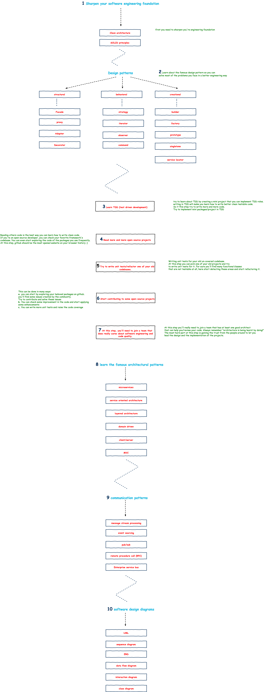

Software architect roadmap
==========================
In general software architect is like the architect in real-life. Hes's responsible for making high-level design
decisions.

### Objective :triangular_flag_on_post:

The objective of this document is giving an overview about the skills required by software engineers to level up and
become a software architect. Still there's no ideal skills required to be gained, but this is just a roadmap to be
followed to highlight the main skills to be gained.

There's no standard roadmap or specific methodology to follow to become an architect. Being a good architect is getting
achieved by applying and implementing more than reading.

Below is a broadway roadmap that you can follow to start being a software architect.

Let's define the 3 categories of software architects

### Solutions architect [very detailed architect]

Solution architect is mainly the one responsible for translating requirements into code. Sometimes we can call him the "
project development team lead" for a specific project. He's responsible for the following:

- Guiding the development team through the implementation process in every technical details.
- Making sure that the developed solution meets the designed architecture.
- Making sure that the developed solution meets the functional requirements.
- Participate in choosing the right design patterns for solving problems.

Solution architect would be guided by the "Enterprise architect".

### Application architect

Application architect is the one responsible for the following:

- Choosing the technologies that will be used to implement the application. He'll be
- Making sure that the team is meeting the standard of the technology used.
- Responsible for choosing and cooperate in developing packages/frameworks that will be used by the team.
- Reliability and scalability of the application.
- Maintaining/refining the development life cycle of the application.

Sometimes they choose one of the development team to be the application architect.

### Enterprise architect [highly abstracted architect]

Enterprise architect is the very highly abstracted architect responsible for the following:

- Designing the high level organizational development process.
- Designing UML that will be used by application/solution architects.
- Should be engaged more with the business mission of the company and the IT strategy.
- Raising the skills of the development team and maintaining their knowledge.

#### Below is a broadway roadmap that you can follow to start being a software architect.

~~~~
1. Start by sharpening your [software engineering](https://en.wikipedia.org/wiki/Software_engineering) foundation
skills. Get hands on the most famous design patterns.

2. Get hands on the most famous [design patterns](https://en.wikipedia.org/wiki/Software_design_pattern). At this step
you should practice it in your day to day join. Start using these design patterns you did learn to solve your problems
while coding.

3. Learn [TDD](https://en.wikipedia.org/wiki/Test-driven_development) basics. Try to create a mini project that uses
TDD patterns. By applying TDD you’ll learn how to write more clean testable code.

4. Read more open-source projects. At this step you’ll can start reading the code of your favourite farmework or even
the code of your most used packages.

5. Try to learn some refactoring patterns. You can start checking your old projects. Check
the [code-smells](https://en.wikipedia.org/wiki/Code_smell), bad design and try to refactor it. You can also try to
write unit test for your old projects, and for sure you’ll find lots of untestable code that needs refactoring.

6. Start contributing to some open-source projects. You can start picking
an [open-source project](https://en.wikipedia.org/wiki/Open-source_software) and check the issue tab and try to fix it.
You can even start writing more unit tests and improve the code coverage. You can also start applying some engineering
improvements.

7. Now you should join a team that really care about software engineering (not to mention Tajawal :wink:). Always
remember architecture is being learnt by doing. You need to work at least under one or two talented architecture to
guide you.

8. You need to gain some trust from the people around to let you guide/lead design and implementation at least for one
project.

9. Now you need to learn about some architectural patterns like [micorservices](https://en.wikipedia.org/wiki/Microservices), [Domain driven design](https://en.wikipedia.org/wiki/Domain-driven_design)
, [layered architecture (multitier architecture)](https://en.wikipedia.org/wiki/Multitier_architecture), [client/server architecture](https://en.wikipedia.org/wiki/Client%E2%80%93server_model),
[service oriented architecture](https://en.wikipedia.org/wiki/Service-oriented_architecture),…

10. You need to learn some communication patterns like message [stream processing](https://en.wikipedia.org/wiki/Stream_processing), [event sourcing](https://martinfowler.com/eaaDev/EventSourcing.html), [remote procedure call (RPC)](https://en.wikipedia.org/wiki/Remote_procedure_call), [Enterprise service bus](https://en.wikipedia.org/wiki/Enterprise_service_bus),…

11. Now you’re an architect that lead some projects but you need to learn some diagrams to show your team your suggested
architecture. You should start learning how to do [UML](https://en.wikipedia.org/wiki/Unified_Modeling_Language), [Data flow diagrams](https://en.wikipedia.org/wiki/Data_flow_diagram), [Interaction diagrams](https://en.wikipedia.org/wiki/Interaction_overview_diagram), [ERD](https://en.wikipedia.org/wiki/Entity%E2%80%93relationship_model), …~~~~~~

## Contribution :muscle:
- This project is created by [Draw.io](https://draw.io/) so for contribution just download the [map.xml](files/map.xml) import it, edit it and update the exported images in `images/map.png`
- If you want to discuss any ideas/suggestions just ping me on 

 or [:email:](mailto:alaa.attya91@gmail.com)
 